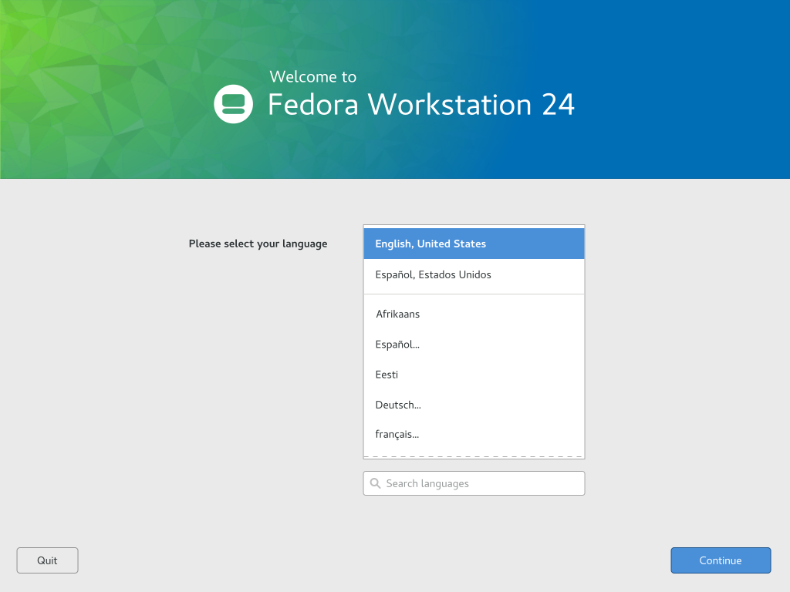

# Anaconda mockups

## Preamble

### Note about Workstation vs. Server

This document covers the default for workstation; server would be different, as
there would be no preinstalled OS. If there is no preinstalled OS, then people
wouldn't see this. All these cases are handled already, as outlined above.
Advanced partitioning is still selectable on the bottom-left for heavy
tinkerers, in case this isn't enough.

This isn't just to "try" Fedora. A lot of people want to use dual-boot for
various reasons — some use Fedora as their main and have Windows / OS X as a
backup for games, special purpose apps, etc.

## Welcome & Choose a Language

Choosing a language is important for two main reasons: firstly, someone using
the installer needs to fully understand what they are doing, so it should be in
a familiar language. Secondly, some things, such as typing passwords (for WiFi
and setting an admin password), require proper keyboard input.

There's no need to have a welcome screen that isn't also useful, so the welcome
screen (as a banner) and language selection is combined.

A filtered language list is shown based on location. Clicking on additional
languages (shown translated to the default selection) would disclose more
available languages.

The language picker would use a sliding drill-down list widget. If a language is
selected where there are multiple variants, then it would slide to reveal a
second list, to get a bit more specific. The interface would automatically
select the first option in the list and would adapt accordingly. If another
language is selected from this list, then it would again refresh.

If location cannot be determined (such as in the case of not having network
available), then a list with the top few most popular languages would be shown,
with all the rest below, in the scrollable list.

At the top of the second level of the chooser is a “back” item, translated to
the selected language. Choosing it would slide back to the previous list, with
this most recent chosen language in the quick area in the first level of the
list. In this example, it would add “Deutsch, Belgein” at the top of the list,
above “English, United States”. Of course, this wouldn't happen in normal usage —
once the correct language is selected, people would generally choose the
continue button (displayed in the selected language, naturally).

## Consistency

> Need to also mockup individual spoke screens - main concern is placement of
the "Done" or "Back" button in the upper left because usability tests still show
users getting confused about button positioning... Not sure how to enforce
hub/spoke model with this button placement. (Mo)

Some screens seem to have dismissing happen on the bottom, whereas others have
it on the top. It's inconsistent within the installer. It's also different from
desktop experiences (even within Fedora), for the most part.

Even GNOME is moving away from the back at the top-left. The only place it's
still used is within OS X's system settings and in iOS. See
https://blogs.gnome.org/aday/2016/01/13/a-settings-design-update/

I will explore button placement when designing spokes. Perhaps it still might
make sense to have the button at the top-left? If so, it would need to be
obvious that it's a button to go back. It currently gets lost as grey on grey —
and also due to the typical information flow of top-left to bottom right.

Quit button is only displayed in an install from a Live Desktop. Otherwise,
there's no button here.

## Resizing

Methods of freeing up space are in the order of simplest to hardest, from a
use-centric point of view (not implementation-wise), with preserving data
prioritized.

Resizing the existing OS (the interface shows "Windows" or "OS X", based on
what's installed to the hard drive — so it's more familiar) would show a
super-simple resize dialog. After resizing (in the interface only, as nothing
will actually happen until installation starts), the installer will proceed to
the summary overview.

If there is more than one disk, there is a disk selector that shows all
available internal disks. It should explicitly exclude all temporary storage
(USB and SD disks, as they are slower, less reliable, and may even accidentally
be removed).

Labels showing which disk is selected appear above the disk overview widget as
to assist in determining which disk is which. (These labels are not needed when
there is only one internal disk.)

Erasing the entire disk, like resizing, this will proceed to the next page and
will actually not do anything until the actual installation procedure begins. If
there's enough free space to install Fedora, proceed immediately to the summary
overview.

… Otherwise, display the not-enough-free-space warning, with some common
solutions.

### Advanced

_**WIP**_

Advanced partitioning will show an informative dialog, then quit the installer
and open up a partitioning tool. When coming back to the installer, it will skip
this step, as there will be adequate free space.

> Consider logic to only present this interface to laptop / single disk /
simpler use cases; should not appear for enterprise / networked storage / heavy
tinkerer use cases. Use case here is for users who have OS X on Mac Book or Win
on store bought laptop who want to try Fedora without sacrificing native OS.
(mo)

[Not pictured — for now use what's currently available.]

## Summary Overview

### Installation destination selection

"To" and "From" are big and clear, indicating what will happen overall.

Icons change based on context If it's from a CD/DVD, it shows a disc.

If the source is a USB stick, it shows an external drive. The network icon shows
either a wired or wireless icon, based on the type of connection.

Installation source will default to the medium from which the installer booted.
It may be changed (for example: to a network-based install).

Installation destination should auto-configure itself by default.

List system configuration in order of most likely to be changed.

Empty disk: Auto-configure all partitions. Free space: Auto-configure remaining
space.

Auto-detect everything possible. For things that are not auto-detected, choose
most likely selections (such as a standard package install)

Pre-existing OS, filling hard drive: Require interaction which displays a quick
resize interface to free up space. Clicking on installation destination area
will show extremely basic disk selection, providing a way for super-basic
partitioning and a link to an advanced method for diving into the deep-end (full
partition editor).

> Is there enough space here for metadata about selections underneath each
spoke? Expand button width to accommodate needed space? Try out in German too
since German words are long and tend to blow things up (Mo)

There's info about what is selected already; what sort of metadata do you mean?
I can try to translate things to German. ☺

> Need notification area to indicate issues / required spokes to go through.
Potentially put underneath the main titlebar area up top since bottom gets cut
off on VMs. (Mo)

None of the spokes are required. The installer auto-selects things based on
context. You don't need a network to install; language was previously selected.
Keyboard default is based on language. Timezone is determined by network or
defaults to GMT. Software set is pre-selected. Storage source & target is
selected as above stated.

The installation prompt is context-aware. It has a custom message based on
whether the drive is being resized or erased.

If Fedora will be installed into empty space without the need to resize or erase
the disk, the installer will skip the confirmation step.

Version that supports hubs for Spins (such as KDE / other desktops without a
first boot experience)

## Default installer (GNOME)

Server should be a little different on the installation screen, as there would
not typically be a post-install configuration for a standard install, unless
Fedora is used as a base in layered server software (example: oVirt, OpenShift,
ManageIQ, etc.).

In the cases where post-install applications do not handle root passwords, or in
vanilla Fedora Server, it needs to have the ability to set admin (root)
passwords.

However, on Workstation, there’s a first boot configuration process which sets
up a user (with admin rights), so setting users and passwords here is
unnecessary (and confusing) for people installing Fedora Workstation.

For Spins that do not default to the GNOME desktop, Workstation may have basic
root & user password configuration on this screen.

> We also need the banners here (mo)

> Need second hub capability here - even if not visible in Fedora workstation,
needed for other variants (eg KDE installs, RHEL installs, etc) (Mo)

### Banner ads

3 “ads” fill 1/3 of remaining space in an installer that installs GNOME by
default. For spins and RHEL, only one 1 shows while the space used for second
hubs is visible. This 1 ad rotates with a timer.

(Three ads stacked. The middle ad is split horizontally into two as an example.)

If there are more than 3 ads, then the ads rotate out 1-by-1, optimally
cross-fading one at a time. (first the first, then the second, then the third,
then the first again.) This is to try to have less of a jarring experience when
people are trying to read what's going one. Ideally, ad sets would be in
multiple of 3s. (Four ads would look odd as things shift.)

(Single ad, where the same three ads as above are rotated through, so the ads
shown are the same even though the UI changes.)

Going 3-up for default installs makes it easier to see what's going on all at
once and allows for the amount of content to scale without having to scale the
ads themselves.

In some cases, no ads will be seen. This is most likely the case for RHEL and CentOS, especially when additional prompts are necessary, such as when a non-GNOME desktop is being installed. (GNOME handles the password and user setup post-install in gnome-initial-setup.)

### Default installer

We might want to make this screen a little flashier. However, I don't think we
need much more functionally on this confirmation screen. The button on this is
probably going to be different depending on if it's a live vs DVD install.

> DVD install has reboot button but live has quit button in case you are using
as rescue media and don't want to reboot. (Mo)

Added a simple solution for a Live-based installation which still solves the
problem of the current installer's "Now what?" after installation.

### Live media installer

Version that supports hubs for RHEL that needs more real estate; no
distro-specific “ads”

Network (native desktop's config tool in Live desktop) embedded mockup is just
an example

### Timezone selector example

All the options show up in a popup dialog. I have included timezone as an
example of how this would work.

### Network example

For the live installer, Anaconda does not handle networking. Instead, it re-uses
GNOME's network configuration. This is an example of how this functions.

Ideally, we would be able to have a reusable widget that does the same thing,
but that follows the cancel & apply dialog approach (as seen in the timezone
example).

## Success!

When installing in a non-live mode, the only option should be rebooting into the
freshly installed OS.

In Live mode, it's necessary to also quit in order to save anything done while
playing around in the live desktop, so the last screen has an additional button
to quit.

